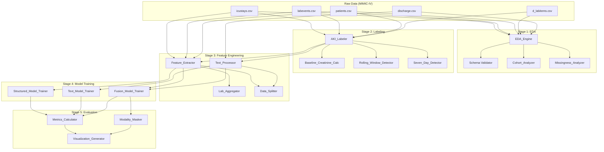

# Design Document: AKI Prediction Pipeline

## Overview

This document provides the technical design for a research-grade machine learning pipeline that predicts Acute Kidney Injury (AKI) after the first 24 hours of ICU admission using MIMIC-IV data. The system implements a phased approach with strict temporal constraints to prevent data leakage, supporting three modeling paradigms: structured-only baseline, text-only analysis, and multimodal fusion.

### System Purpose

The pipeline serves as a scientific research tool for investigating AKI prediction using electronic health records. It implements KDIGO (Kidney Disease: Improving Global Outcomes) clinical practice guidelines for AKI diagnosis while maintaining rigorous temporal boundaries to ensure predictions are clinically realistic. The system is designed for reproducibility and publication-quality results.

### Key Design Principles

1. **Temporal Validity**: Strict 24-hour cutoff ensures no future data leakage
2. **Modular Architecture**: Independent scripts for each phase enable isolated testing and debugging
3. **Patient-Level Splitting**: Prevents data contamination across train/validation/test sets
4. **Reproducibility**: Fixed random seeds, comprehensive logging, and version-controlled dependencies
5. **Research Rigor**: Publication-quality visualizations, statistical summaries, and transparent methodology

### High-Level Architecture

The pipeline consists of five major stages executed sequentially:

1. **Exploratory Data Analysis (EDA)**: Schema validation, cohort visualization, missingness analysis
2. **AKI Labeling**: KDIGO-based binary label assignment with baseline creatinine computation
3. **Feature Engineering**: Structured feature extraction, text embedding generation, data splitting
4. **Model Training**: Phase 1 (structured), Phase 2 (text), Phase 3 (multimodal fusion)
5. **Evaluation & Robustness Testing**: Comprehensive metrics, Phase 4 modality masking


## Architecture

### Component Diagram



### Data Flow

1. **Raw Data → EDA**: CSV files are loaded, validated, and analyzed for schema, distributions, and missingness patterns
2. **Raw Data → AKI Labeling**: ICU stays are filtered (≥24h duration), baseline creatinine computed, KDIGO criteria evaluated
3. **Labeled Data → Feature Engineering**: Structured features extracted from first 24h, text embeddings generated, patient-level splitting performed
4. **Processed Features → Model Training**: Three phases train models with different modality combinations
5. **Trained Models → Evaluation**: Comprehensive metrics computed, robustness testing via modality masking

### Component Responsibilities

**EDA_Engine**: Validates data schemas, generates cohort statistics, visualizes distributions, analyzes missingness patterns

**AKI_Labeler**: Filters ICU stays by duration, computes baseline creatinine (same-admission only), evaluates 48h rolling window and 7-day criteria, assigns binary labels

**Feature_Extractor**: Extracts demographics, baseline creatinine, aggregates lab values (mean/min/max/std/first/last), creates missingness indicators, applies median imputation

**Lab_Aggregator**: Selects labs with ≥30% coverage, computes temporal aggregations within first 24h, excludes creatinine from aggregated features

**Text_Processor**: Links discharge summaries to ICU stays, cleans text, generates BioClinicalBERT embeddings, handles missing text with zero vectors

**Data_Splitter**: Partitions patients (not ICU stays) into 70/15/15 splits, ensures no patient overlap, verifies AKI prevalence balance

**Structured_Model_Trainer**: Trains Logistic Regression and Random Forest on structured features only (Phase 1)

**Text_Model_Trainer**: Trains classifier on BioClinicalBERT embeddings only (Phase 2)

**Fusion_Model_Trainer**: Trains MLP on concatenated structured + text features (Phase 3)

**Modality_Masker**: Tests trained fusion model with zero-masked modalities at inference time (Phase 4)

**Metrics_Calculator**: Computes AUROC, AUPRC, accuracy, precision, recall, F1, generates ROC/PR curves

**Visualization_Generator**: Creates publication-quality plots (300 DPI PNG) for cohort analysis, model comparison, and robustness results


## Components and Interfaces

### 1. EDA_Engine

**Purpose**: Perform exploratory data analysis, schema validation, and generate publication-quality visualizations.

**Inputs**:
- `raw_data/icustays.csv`: ICU stay records
- `raw_data/labevents.csv`: Laboratory measurements
- `raw_data/patients.csv`: Patient demographics
- `raw_data/d_labitems.csv`: Lab item dictionary
- `raw_data/discharge.csv`: Discharge summaries

**Outputs**:
- `logs/schema_documentation.json`: Column names, types, null counts, primary/foreign keys
- `figures/icu_stay_length_distribution.png`: Histogram of ICU durations
- `figures/icu_stays_per_patient.png`: Histogram of stay counts per patient
- `figures/age_distribution.png`: Patient age histogram
- `figures/gender_distribution.png`: Gender bar chart
- `figures/creatinine_distribution.png`: Raw creatinine value histogram
- `figures/lab_coverage.png`: Bar chart of lab test availability
- `figures/missingness_rates.png`: Bar chart of missing rates by feature
- `results/missingness_statistics.csv`: Detailed missingness metrics

**Key Methods**:
- `validate_schema()`: Checks column types, identifies keys, documents relationships
- `analyze_cohort()`: Generates demographic and stay duration visualizations
- `analyze_labs()`: Visualizes lab distributions and coverage
- `analyze_missingness()`: Computes and visualizes missing data patterns

**Interface**:
```python
class EDA_Engine:
    def __init__(self, raw_data_dir: str, output_dirs: dict):
        """Initialize with paths to raw data and output directories."""
        
    def validate_schema(self) -> dict:
        """Validate and document data schemas."""
        
    def analyze_cohort(self) -> None:
        """Generate cohort visualizations."""
        
    def analyze_labs(self) -> None:
        """Analyze laboratory data patterns."""
        
    def analyze_missingness(self) -> None:
        """Compute and visualize missingness patterns."""
        
    def run_full_eda(self) -> None:
        """Execute complete EDA pipeline."""
```


### 2. AKI_Labeler

**Purpose**: Assign binary AKI labels using KDIGO criteria with strict temporal constraints.

**Inputs**:
- `raw_data/icustays.csv`: ICU stay records with intime/outtime
- `raw_data/labevents.csv`: Creatinine measurements (itemid 50912)
- `raw_data/patients.csv`: Patient demographics for age calculation
- `raw_data/d_labitems.csv`: Verification of creatinine itemid

**Outputs**:
- `processed_data/labeled_stays.csv`: Columns: subject_id, hadm_id, stay_id, intime, outtime, duration_hours, baseline_creatinine, aki_label
- `logs/labeling_summary.log`: Counts of excluded stays, AKI prevalence, baseline computation statistics

**Key Algorithms**:

1. **Duration Filtering**: 
   - Compute `duration_hours = (outtime - intime).total_seconds() / 3600`
   - Exclude if `duration_hours < 24`

2. **Baseline Creatinine Computation**:
   - Filter creatinine measurements: `same hadm_id AND charttime < intime`
   - If any exist: `baseline = min(creatinine_values)`
   - Else: `baseline = first creatinine during ICU stay`

3. **48-Hour Rolling Window Detection**:
   - Filter creatinine: `charttime >= intime + 24h`
   - For each pair (cr_i, cr_j) where `0 < (time_j - time_i) <= 48h`:
     - If `(cr_j - cr_i) >= 0.3 AND time_j > time_i`: return True
   - Return False
   - **Note**: KDIGO criteria require an INCREASE in creatinine ≥0.3 mg/dL, not absolute difference. Decreases should NOT trigger AKI.

4. **7-Day Criterion Detection**:
   - Filter creatinine: `charttime >= intime + 24h AND charttime <= min(outtime, intime + 7d)`
   - For each measurement: If `creatinine / baseline >= 1.5`: return True
   - Return False

5. **Label Assignment**:
   - `aki_label = 1` if (48h criterion OR 7d criterion)
   - `aki_label = 0` otherwise

**Interface**:
```python
class AKI_Labeler:
    def __init__(self, raw_data_dir: str, output_dir: str):
        """Initialize with data paths."""
        
    def verify_creatinine_itemid(self) -> None:
        """Verify itemid 50912 is creatinine."""
        
    def filter_by_duration(self, stays_df: pd.DataFrame) -> pd.DataFrame:
        """Exclude stays < 24 hours."""
        
    def compute_baseline_creatinine(self, stay_id: str) -> float:
        """Compute baseline creatinine for a single stay."""
        
    def check_48h_criterion(self, stay_id: str, baseline: float) -> bool:
        """Evaluate 48-hour rolling window criterion."""
        
    def check_7d_criterion(self, stay_id: str, baseline: float) -> bool:
        """Evaluate 7-day criterion."""
        
    def label_all_stays(self) -> pd.DataFrame:
        """Label all ICU stays with AKI."""
        
    def run(self) -> None:
        """Execute complete labeling pipeline."""
```


### 3. Feature_Extractor

**Purpose**: Extract structured features from the first 24 hours of ICU admission.

**Inputs**:
- `processed_data/labeled_stays.csv`: Labeled ICU stays with baseline creatinine
- `raw_data/labevents.csv`: Laboratory measurements
- `raw_data/patients.csv`: Demographics
- `raw_data/icustays.csv`: ICU type information
- `raw_data/d_labitems.csv`: Lab item dictionary

**Outputs**:
- `processed_data/structured_dataset.csv`: Feature matrix with columns:
  - Identifiers: subject_id, stay_id, aki_label
  - Demographics: age, gender_binary, icu_type_onehot_*
  - Baseline: baseline_creatinine
  - Lab aggregations: {lab_name}_{mean|min|max|std|first|last}, {lab_name}_missing
- `logs/feature_extraction.log`: Selected labs, coverage statistics, imputation values

**Key Algorithms**:

1. **Lab Selection**:
   - Compute coverage: `count(stays with lab) / total_stays`
   - Select labs with `coverage >= 0.30`
   - Prioritize: BUN, Sodium, Potassium, Chloride, Bicarbonate, Lactate, WBC, Hemoglobin, Platelets, Glucose, Calcium, Magnesium, Phosphate
   - Exclude creatinine from aggregated features

2. **Temporal Filtering**:
   - For each stay: `lab_measurements = filter(charttime < intime + 24h)`

3. **Lab Aggregation** (per stay, per lab):
   - mean: `np.mean(values)`
   - min: `np.min(values)`
   - max: `np.max(values)`
   - std: `np.std(values)`
   - first: `values[0]` (chronologically)
   - last: `values[-1]` (chronologically)
   - missing: `1 if no measurements else 0`

4. **Imputation** (computed on training set only):
   - For each feature: `imputation_value = np.median(train_values[~np.isnan(train_values)])`
   - Apply to all splits: `feature[np.isnan(feature)] = imputation_value`

5. **Demographic Extraction**:
   - age: `(icu_intime - date_of_birth).days / 365.25`
   - gender: `1 if 'M' else 0`
   - icu_type: one-hot encoding

**Interface**:
```python
class Feature_Extractor:
    def __init__(self, data_dir: str, output_dir: str):
        """Initialize with data paths."""
        
    def select_labs(self, min_coverage: float = 0.30) -> list:
        """Select labs meeting coverage threshold."""
        
    def extract_demographics(self, stay_id: str) -> dict:
        """Extract age, gender, ICU type."""
        
    def aggregate_labs(self, stay_id: str, lab_itemids: list) -> dict:
        """Compute lab aggregations for first 24h."""
        
    def compute_imputation_values(self, train_df: pd.DataFrame) -> dict:
        """Compute median imputation values from training set."""
        
    def apply_imputation(self, df: pd.DataFrame, imputation_dict: dict) -> pd.DataFrame:
        """Apply imputation and create missingness indicators."""
        
    def extract_all_features(self) -> pd.DataFrame:
        """Extract features for all stays."""
        
    def run(self) -> None:
        """Execute feature extraction pipeline."""
```


### 4. Text_Processor

**Purpose**: Generate BioClinicalBERT embeddings from discharge summaries.

**Inputs**:
- `raw_data/discharge.csv`: Discharge summaries with hadm_id
- `processed_data/labeled_stays.csv`: ICU stays to link summaries

**Outputs**:
- `processed_data/text_embeddings.npy`: NumPy array of shape (n_stays, 768) with BioClinicalBERT embeddings
- `processed_data/text_stay_ids.csv`: Mapping of row indices to stay_id
- `logs/text_processing.log`: Missing text statistics, processing time

**Key Algorithms**:

1. **Text Linking**:
   - Join discharge summaries to ICU stays on `hadm_id`
   - If multiple summaries per stay: concatenate chronologically

2. **Text Cleaning**:
   - Remove non-ASCII characters: `text.encode('ascii', 'ignore').decode()`
   - Normalize whitespace: `re.sub(r'\s+', ' ', text).strip()`
   - Remove special characters: `re.sub(r'[^\w\s.,;:!?-]', '', text)`

3. **Embedding Generation**:
   - Load BioClinicalBERT: `AutoModel.from_pretrained('emilyalsentzer/Bio_ClinicalBERT')`
   - Tokenize with max length 512: `tokenizer(text, max_length=512, truncation=True)`
   - Extract [CLS] token embedding: `model(**inputs).last_hidden_state[:, 0, :]`
   - Process in batches of 32 for memory efficiency

4. **Missing Text Handling**:
   - If no discharge summary: `embedding = np.zeros(768)`

**Interface**:
```python
class Text_Processor:
    def __init__(self, data_dir: str, output_dir: str, model_name: str = 'emilyalsentzer/Bio_ClinicalBERT'):
        """Initialize with data paths and model."""
        
    def link_summaries_to_stays(self) -> pd.DataFrame:
        """Link discharge summaries to ICU stays."""
        
    def clean_text(self, text: str) -> str:
        """Clean and normalize text."""
        
    def generate_embeddings(self, texts: list, batch_size: int = 32) -> np.ndarray:
        """Generate BioClinicalBERT embeddings."""
        
    def save_embeddings(self, embeddings: np.ndarray, stay_ids: list) -> None:
        """Save embeddings and stay ID mapping."""
        
    def run(self) -> None:
        """Execute text processing pipeline."""
```


### 5. Data_Splitter

**Purpose**: Partition data into train/validation/test sets at patient level.

**Inputs**:
- `processed_data/structured_dataset.csv`: Structured features
- `processed_data/text_embeddings.npy`: Text embeddings (if available)

**Outputs**:
- `processed_data/train_patients.csv`: List of subject_ids in training set
- `processed_data/val_patients.csv`: List of subject_ids in validation set
- `processed_data/test_patients.csv`: List of subject_ids in test set
- `processed_data/X_train_structured.npy`, `y_train.npy`: Training data
- `processed_data/X_val_structured.npy`, `y_val.npy`: Validation data
- `processed_data/X_test_structured.npy`, `y_test.npy`: Test data
- `processed_data/X_train_text.npy`, etc.: Text embeddings split
- `logs/data_splitting.log`: Split statistics, AKI prevalence per split

**Key Algorithms**:

1. **Patient-Level Splitting**:
   ```python
   unique_patients = df['subject_id'].unique()
   np.random.seed(42)
   np.random.shuffle(unique_patients)
   
   n_train = int(0.70 * len(unique_patients))
   n_val = int(0.15 * len(unique_patients))
   
   train_patients = unique_patients[:n_train]
   val_patients = unique_patients[n_train:n_train+n_val]
   test_patients = unique_patients[n_train+n_val:]
   ```

2. **Stay Assignment**:
   - Assign all stays from a patient to the same split
   - `train_stays = df[df['subject_id'].isin(train_patients)]`

3. **Integrity Verification**:
   - Check: `len(set(train_patients) & set(val_patients)) == 0`
   - Check: `len(set(train_patients) & set(test_patients)) == 0`
   - Check: `len(set(val_patients) & set(test_patients)) == 0`

4. **Balance Verification**:
   - Compute AKI prevalence per split
   - Log warning if difference > 10 percentage points

**Interface**:
```python
class Data_Splitter:
    def __init__(self, data_dir: str, output_dir: str, seed: int = 42):
        """Initialize with data paths and random seed."""
        
    def split_patients(self, proportions: tuple = (0.70, 0.15, 0.15)) -> dict:
        """Split patients into train/val/test."""
        
    def assign_stays_to_splits(self, patient_splits: dict) -> dict:
        """Assign ICU stays based on patient splits."""
        
    def verify_split_integrity(self, patient_splits: dict) -> bool:
        """Verify no patient overlap between splits."""
        
    def verify_balance(self, stay_splits: dict) -> None:
        """Check AKI prevalence balance."""
        
    def save_splits(self, stay_splits: dict) -> None:
        """Save split data to files."""
        
    def run(self) -> None:
        """Execute data splitting pipeline."""
```


### 6. Model Trainers

#### Structured_Model_Trainer (Phase 1)

**Purpose**: Train baseline models using only structured features.

**Inputs**:
- `processed_data/X_train_structured.npy`, `y_train.npy`
- `processed_data/X_val_structured.npy`, `y_val.npy`

**Outputs**:
- `models/logistic_regression.pkl`: Trained Logistic Regression model
- `models/random_forest.pkl`: Trained Random Forest model
- `models/scaler.pkl`: StandardScaler fitted on training data
- `models/logistic_regression_params.json`: Hyperparameters
- `models/random_forest_params.json`: Hyperparameters
- `logs/phase1_training.log`: Training duration, validation metrics

**Key Algorithms**:

1. **Feature Scaling**:
   ```python
   scaler = StandardScaler()
   X_train_scaled = scaler.fit_transform(X_train)
   X_val_scaled = scaler.transform(X_val)
   ```

2. **Logistic Regression**:
   ```python
   lr = LogisticRegression(random_state=42, max_iter=1000, solver='lbfgs', class_weight='balanced')
   lr.fit(X_train_scaled, y_train)
   ```
   - **Note**: `class_weight='balanced'` adjusts for class imbalance, as AKI is typically a minority class in ICU populations.

3. **Random Forest**:
   ```python
   rf = RandomForestClassifier(n_estimators=100, random_state=42, max_depth=10, class_weight='balanced')
   rf.fit(X_train_scaled, y_train)
   ```
   - **Note**: `class_weight='balanced'` helps the model learn from minority class examples.

**Interface**:
```python
class Structured_Model_Trainer:
    def __init__(self, data_dir: str, output_dir: str, seed: int = 42):
        """Initialize with data paths and random seed."""
        
    def load_data(self) -> tuple:
        """Load training and validation data."""
        
    def scale_features(self, X_train: np.ndarray, X_val: np.ndarray) -> tuple:
        """Fit scaler on training data and transform both sets."""
        
    def train_logistic_regression(self, X_train: np.ndarray, y_train: np.ndarray) -> object:
        """Train Logistic Regression model."""
        
    def train_random_forest(self, X_train: np.ndarray, y_train: np.ndarray) -> object:
        """Train Random Forest model."""
        
    def save_models(self, models: dict) -> None:
        """Save trained models and hyperparameters."""
        
    def run(self) -> None:
        """Execute Phase 1 training pipeline."""
```


#### Text_Model_Trainer (Phase 2)

**Purpose**: Train classifier using only BioClinicalBERT embeddings.

**Inputs**:
- `processed_data/X_train_text.npy`, `y_train.npy`
- `processed_data/X_val_text.npy`, `y_val.npy`

**Outputs**:
- `models/text_classifier.pkl`: Trained text-only model
- `models/text_classifier_params.json`: Hyperparameters
- `logs/phase2_training.log`: Training duration, validation metrics

**Key Algorithms**:

1. **Text Classifier** (Logistic Regression on embeddings):
   ```python
   text_clf = LogisticRegression(random_state=42, max_iter=1000, solver='lbfgs')
   text_clf.fit(X_train_text, y_train)
   ```

**Interface**:
```python
class Text_Model_Trainer:
    def __init__(self, data_dir: str, output_dir: str, seed: int = 42):
        """Initialize with data paths and random seed."""
        
    def load_data(self) -> tuple:
        """Load text embeddings and labels."""
        
    def train_text_classifier(self, X_train: np.ndarray, y_train: np.ndarray) -> object:
        """Train text-only classifier."""
        
    def save_model(self, model: object) -> None:
        """Save trained model and hyperparameters."""
        
    def run(self) -> None:
        """Execute Phase 2 training pipeline."""
```

#### Fusion_Model_Trainer (Phase 3)

**Purpose**: Train multimodal model combining structured and text features.

**Inputs**:
- `processed_data/X_train_structured.npy`, `X_train_text.npy`, `y_train.npy`
- `processed_data/X_val_structured.npy`, `X_val_text.npy`, `y_val.npy`
- `models/scaler.pkl`: Pre-fitted scaler from Phase 1

**Outputs**:
- `models/fusion_model.pkl`: Trained fusion MLP
- `models/fusion_model_params.json`: Architecture and hyperparameters
- `logs/phase3_training.log`: Training duration, validation metrics

**Key Algorithms**:

1. **Feature Concatenation**:
   ```python
   X_train_scaled = scaler.transform(X_train_structured)
   X_train_fusion = np.concatenate([X_train_scaled, X_train_text], axis=1)
   ```

2. **MLP Architecture**:
   ```python
   from sklearn.neural_network import MLPClassifier
   
   fusion_mlp = MLPClassifier(
       hidden_layer_sizes=(256, 128, 64),
       activation='relu',
       solver='adam',
       random_state=42,
       max_iter=500,
       early_stopping=True,
       validation_fraction=0.1
   )
   fusion_mlp.fit(X_train_fusion, y_train)
   ```

**Interface**:
```python
class Fusion_Model_Trainer:
    def __init__(self, data_dir: str, output_dir: str, seed: int = 42):
        """Initialize with data paths and random seed."""
        
    def load_data(self) -> tuple:
        """Load structured features, text embeddings, and labels."""
        
    def concatenate_features(self, X_structured: np.ndarray, X_text: np.ndarray) -> np.ndarray:
        """Concatenate scaled structured features with text embeddings."""
        
    def train_fusion_model(self, X_train: np.ndarray, y_train: np.ndarray) -> object:
        """Train multimodal MLP."""
        
    def save_model(self, model: object) -> None:
        """Save trained model and hyperparameters."""
        
    def run(self) -> None:
        """Execute Phase 3 training pipeline."""
```


### 7. Evaluation Components

#### Metrics_Calculator

**Purpose**: Compute comprehensive evaluation metrics for all models.

**Inputs**:
- `models/*.pkl`: Trained models
- `processed_data/X_test_*.npy`, `y_test.npy`: Test data

**Outputs**:
- `results/model_metrics.csv`: AUROC, AUPRC, accuracy, precision, recall, F1, Brier score for all models
- `figures/roc_curves.png`: ROC curves for all models
- `figures/pr_curves.png`: Precision-Recall curves for all models
- `figures/calibration_curves.png`: Calibration plots for all models
- `figures/model_comparison_auroc.png`: Bar chart comparing AUROC
- `figures/model_comparison_auprc.png`: Bar chart comparing AUPRC
- `figures/model_comparison_metrics.png`: Grouped bar chart for precision/recall/F1

**Key Algorithms**:

1. **Metric Computation**:
   ```python
   from sklearn.metrics import roc_auc_score, average_precision_score, accuracy_score, precision_recall_fscore_support, brier_score_loss
   from sklearn.calibration import calibration_curve
   
   y_pred_proba = model.predict_proba(X_test)[:, 1]
   y_pred = model.predict(X_test)
   
   auroc = roc_auc_score(y_test, y_pred_proba)
   auprc = average_precision_score(y_test, y_pred_proba)
   accuracy = accuracy_score(y_test, y_pred)
   precision, recall, f1, _ = precision_recall_fscore_support(y_test, y_pred, average='binary')
   brier = brier_score_loss(y_test, y_pred_proba)
   ```
   - **Note**: Brier score measures calibration quality (lower is better). Medical reviewers value calibration metrics as they indicate whether predicted probabilities are reliable for clinical decision-making.

2. **ROC Curve Generation**:
   ```python
   from sklearn.metrics import roc_curve
   
   fpr, tpr, _ = roc_curve(y_test, y_pred_proba)
   plt.plot(fpr, tpr, label=f'{model_name} (AUROC={auroc:.3f})')
   ```

3. **Calibration Curve Generation**:
   ```python
   fraction_of_positives, mean_predicted_value = calibration_curve(y_test, y_pred_proba, n_bins=10)
   plt.plot(mean_predicted_value, fraction_of_positives, marker='o', label=model_name)
   plt.plot([0, 1], [0, 1], 'k--', label='Perfect calibration')
   ```
   - **Note**: Calibration curves show reliability diagrams with 10 bins. Points near the diagonal indicate well-calibrated probabilities.

**Interface**:
```python
class Metrics_Calculator:
    def __init__(self, models_dir: str, data_dir: str, output_dir: str):
        """Initialize with model and data paths."""
        
    def load_models(self) -> dict:
        """Load all trained models."""
        
    def compute_metrics(self, model: object, X_test: np.ndarray, y_test: np.ndarray) -> dict:
        """Compute all evaluation metrics including Brier score."""
        
    def generate_roc_curves(self, models: dict, X_test: np.ndarray, y_test: np.ndarray) -> None:
        """Generate and save ROC curves."""
        
    def generate_pr_curves(self, models: dict, X_test: np.ndarray, y_test: np.ndarray) -> None:
        """Generate and save Precision-Recall curves."""
        
    def generate_calibration_curves(self, models: dict, X_test: np.ndarray, y_test: np.ndarray) -> None:
        """Generate and save calibration plots (10-bin reliability diagrams)."""
        
    def generate_comparison_plots(self, metrics_df: pd.DataFrame) -> None:
        """Generate model comparison visualizations."""
        
    def run(self) -> None:
        """Execute evaluation pipeline."""
```


#### Modality_Masker (Phase 4)

**Purpose**: Test fusion model robustness with missing modalities at inference time.

**Inputs**:
- `models/fusion_model.pkl`: Trained fusion model
- `models/scaler.pkl`: Feature scaler
- `processed_data/X_test_structured.npy`, `X_test_text.npy`, `y_test.npy`

**Outputs**:
- `results/robustness_metrics.csv`: Metrics for full model, text-masked, structured-masked
- `results/performance_degradation.csv`: Percentage drops relative to full model
- `figures/robustness_comparison.png`: Bar chart comparing performance across masking conditions

**Key Algorithms**:

1. **Full Model Evaluation**:
   ```python
   X_test_scaled = scaler.transform(X_test_structured)
   X_test_fusion = np.concatenate([X_test_scaled, X_test_text], axis=1)
   y_pred_full = fusion_model.predict_proba(X_test_fusion)[:, 1]
   auroc_full = roc_auc_score(y_test, y_pred_full)
   ```

2. **Text Modality Masking**:
   ```python
   X_test_text_masked = np.zeros_like(X_test_text)
   X_test_fusion_text_masked = np.concatenate([X_test_scaled, X_test_text_masked], axis=1)
   y_pred_text_masked = fusion_model.predict_proba(X_test_fusion_text_masked)[:, 1]
   auroc_text_masked = roc_auc_score(y_test, y_pred_text_masked)
   ```

3. **Structured Modality Masking**:
   ```python
   X_test_structured_masked = np.zeros_like(X_test_scaled)
   X_test_fusion_struct_masked = np.concatenate([X_test_structured_masked, X_test_text], axis=1)
   y_pred_struct_masked = fusion_model.predict_proba(X_test_fusion_struct_masked)[:, 1]
   auroc_struct_masked = roc_auc_score(y_test, y_pred_struct_masked)
   ```

4. **Performance Degradation**:
   ```python
   text_drop_pct = 100 * (auroc_full - auroc_text_masked) / auroc_full
   struct_drop_pct = 100 * (auroc_full - auroc_struct_masked) / auroc_full
   ```

**Interface**:
```python
class Modality_Masker:
    def __init__(self, models_dir: str, data_dir: str, output_dir: str):
        """Initialize with model and data paths."""
        
    def load_fusion_model(self) -> tuple:
        """Load fusion model and scaler."""
        
    def evaluate_full_model(self, X_structured: np.ndarray, X_text: np.ndarray, y_test: np.ndarray) -> dict:
        """Evaluate fusion model with all modalities."""
        
    def evaluate_text_masked(self, X_structured: np.ndarray, X_text: np.ndarray, y_test: np.ndarray) -> dict:
        """Evaluate with text modality replaced by zeros."""
        
    def evaluate_structured_masked(self, X_structured: np.ndarray, X_text: np.ndarray, y_test: np.ndarray) -> dict:
        """Evaluate with structured modality replaced by zeros."""
        
    def compute_degradation(self, full_metrics: dict, masked_metrics: dict) -> dict:
        """Compute percentage performance drops."""
        
    def generate_robustness_plots(self, results: pd.DataFrame) -> None:
        """Generate robustness comparison visualizations."""
        
    def run(self) -> None:
        """Execute Phase 4 robustness testing."""
```


## Data Models

### ICU Stay Record

**Source**: `icustays.csv`

**Schema**:
```python
{
    'subject_id': int,        # Patient identifier
    'hadm_id': int,           # Hospital admission identifier
    'stay_id': int,           # ICU stay identifier (primary key)
    'intime': datetime,       # ICU admission timestamp
    'outtime': datetime,      # ICU discharge timestamp
    'first_careunit': str     # Initial ICU type
}
```

**Derived Fields**:
```python
{
    'duration_hours': float   # (outtime - intime).total_seconds() / 3600
}
```

### Laboratory Event

**Source**: `labevents.csv`

**Schema**:
```python
{
    'subject_id': int,        # Patient identifier
    'hadm_id': int,           # Hospital admission identifier
    'itemid': int,            # Lab test identifier (foreign key to d_labitems)
    'charttime': datetime,    # Measurement timestamp
    'value': float,           # Numeric measurement value
    'valuenum': float         # Alternative numeric field
}
```

**Key itemids**:
- 50912: Creatinine (mg/dL)
- Additional labs selected based on ≥30% coverage

### Patient Demographics

**Source**: `patients.csv`

**Schema**:
```python
{
    'subject_id': int,        # Patient identifier (primary key)
    'gender': str,            # 'M' or 'F'
    'anchor_age': int,        # Age at anchor year
    'anchor_year': int,       # Reference year for age calculation
    'dod': datetime           # Date of death (if applicable)
}
```

### Discharge Summary

**Source**: `discharge.csv`

**Schema**:
```python
{
    'subject_id': int,        # Patient identifier
    'hadm_id': int,           # Hospital admission identifier
    'note_id': str,           # Note identifier
    'note_type': str,         # 'Discharge summary'
    'charttime': datetime,    # Note creation timestamp
    'text': str               # Full discharge summary text
}
```


### Labeled ICU Stay

**Source**: Output of AKI_Labeler

**Schema**:
```python
{
    'subject_id': int,              # Patient identifier
    'hadm_id': int,                 # Hospital admission identifier
    'stay_id': int,                 # ICU stay identifier (primary key)
    'intime': datetime,             # ICU admission timestamp
    'outtime': datetime,            # ICU discharge timestamp
    'duration_hours': float,        # ICU stay duration
    'baseline_creatinine': float,   # Baseline creatinine (mg/dL)
    'aki_label': int                # 0 = no AKI, 1 = AKI
}
```

**Constraints**:
- `duration_hours >= 24.0`
- `baseline_creatinine > 0`
- `aki_label in {0, 1}`

### Structured Feature Vector

**Source**: Output of Feature_Extractor

**Schema**:
```python
{
    # Identifiers
    'subject_id': int,
    'stay_id': int,
    'aki_label': int,
    
    # Demographics
    'age': float,                   # Years
    'gender_binary': int,           # 1 = Male, 0 = Female
    'icu_type_MICU': int,           # One-hot encoded ICU types
    'icu_type_SICU': int,
    'icu_type_CCU': int,
    # ... additional ICU types
    
    # Baseline
    'baseline_creatinine': float,   # mg/dL
    
    # Lab aggregations (example for BUN)
    'BUN_mean': float,
    'BUN_min': float,
    'BUN_max': float,
    'BUN_std': float,
    'BUN_first': float,
    'BUN_last': float,
    'BUN_missing': int,             # 1 if no measurements, 0 otherwise
    
    # ... repeated for each selected lab
}
```

**Feature Count**: ~100-150 features depending on lab selection

**Data Types**:
- Identifiers: int64
- Features: float64
- Missing indicators: int64


### Text Embedding Vector

**Source**: Output of Text_Processor

**Format**: NumPy array

**Schema**:
```python
{
    'embeddings': np.ndarray,       # Shape: (n_stays, 768), dtype: float32
    'stay_ids': list[int]           # Corresponding stay_id for each row
}
```

**Properties**:
- Dimension: 768 (BioClinicalBERT hidden size)
- Missing text: Zero vector [0, 0, ..., 0]
- Normalized: L2 norm typically in range [0.5, 1.5]

### Model Artifacts

#### Structured Models

**Files**:
- `logistic_regression.pkl`: Scikit-learn LogisticRegression object
- `random_forest.pkl`: Scikit-learn RandomForestClassifier object
- `scaler.pkl`: Scikit-learn StandardScaler object

**Hyperparameters** (JSON):
```json
{
    "model_type": "LogisticRegression",
    "random_state": 42,
    "max_iter": 1000,
    "solver": "lbfgs",
    "penalty": "l2",
    "C": 1.0,
    "class_weight": "balanced"
}
```

#### Text Model

**Files**:
- `text_classifier.pkl`: Scikit-learn classifier on embeddings

**Hyperparameters** (JSON):
```json
{
    "model_type": "LogisticRegression",
    "random_state": 42,
    "max_iter": 1000,
    "input_dim": 768
}
```

#### Fusion Model

**Files**:
- `fusion_model.pkl`: Scikit-learn MLPClassifier

**Hyperparameters** (JSON):
```json
{
    "model_type": "MLPClassifier",
    "hidden_layer_sizes": [256, 128, 64],
    "activation": "relu",
    "solver": "adam",
    "random_state": 42,
    "max_iter": 500,
    "early_stopping": true,
    "validation_fraction": 0.1,
    "input_dim_structured": 120,
    "input_dim_text": 768,
    "input_dim_total": 888
}
```


### Evaluation Results

**Metrics CSV Schema**:
```python
{
    'model_name': str,              # e.g., 'logistic_regression', 'fusion_model'
    'phase': int,                   # 1, 2, or 3
    'auroc': float,                 # Area under ROC curve
    'auprc': float,                 # Area under Precision-Recall curve
    'accuracy': float,              # Classification accuracy
    'precision': float,             # Positive predictive value
    'recall': float,                # Sensitivity / True positive rate
    'f1_score': float,              # Harmonic mean of precision and recall
    'brier_score': float,           # Calibration quality metric (lower is better)
    'n_test_samples': int,          # Number of test samples
    'n_positive': int,              # Number of AKI cases in test set
    'n_negative': int               # Number of non-AKI cases in test set
}
```

**Robustness Results CSV Schema**:
```python
{
    'condition': str,               # 'full', 'text_masked', 'structured_masked'
    'auroc': float,
    'auprc': float,
    'accuracy': float,
    'precision': float,
    'recall': float,
    'f1_score': float,
    'auroc_drop_pct': float,        # Percentage drop from full model
    'auprc_drop_pct': float
}
```

### Data Split Metadata

**Patient Split Files**:
- `train_patients.csv`: Columns: subject_id
- `val_patients.csv`: Columns: subject_id
- `test_patients.csv`: Columns: subject_id

**Split Statistics** (logged):
```python
{
    'n_train_patients': int,
    'n_val_patients': int,
    'n_test_patients': int,
    'n_train_stays': int,
    'n_val_stays': int,
    'n_test_stays': int,
    'train_aki_prevalence': float,  # Percentage
    'val_aki_prevalence': float,
    'test_aki_prevalence': float
}
```

